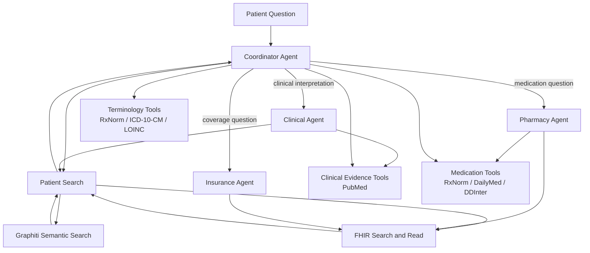
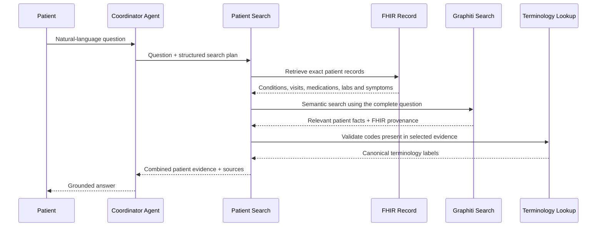
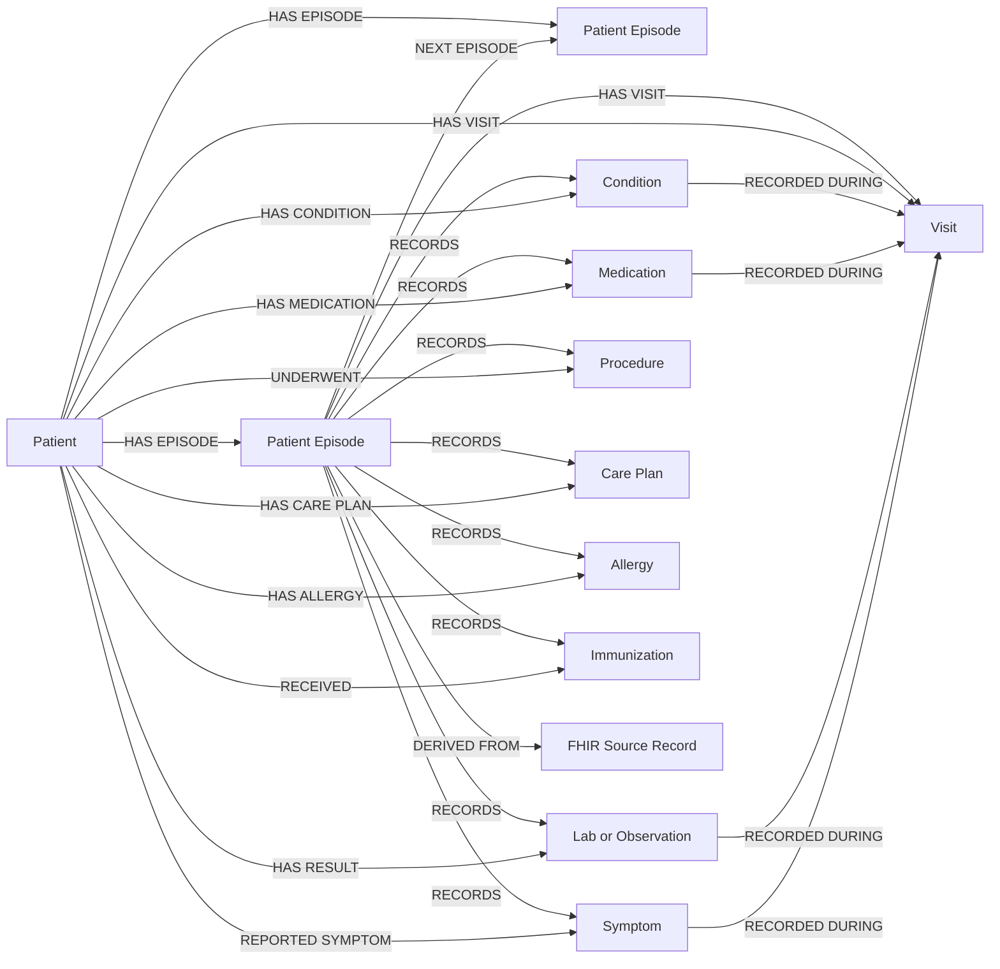

# Agent and Patient Graph Architecture

## Agents and Tools

| Agent | Main responsibility | Tools used |
|---|---|---|
| Coordinator Agent | Understands the question, calls patient search, and selects one specialist when needed | Patient Search, FHIR, terminology, medication and evidence tools |
| Clinical Agent | Explains trends, concerns, follow-up and supporting research | Patient Search, FHIR, PubMed |
| Pharmacy Agent | Handles medication identity, labels, side effects and interactions | FHIR, RxNorm, DailyMed, DDInter |
| Insurance Agent | Explains coverage information recorded for the patient | FHIR |

## How Patient Search Runs

Patient Search always combines:

1. Exact and structured patient-record retrieval.
2. Keyword and fuzzy matching over the patient record.
3. Graphiti semantic search over the patient memory graph.
4. FHIR provenance and terminology validation.

## Patient Memory Graph (Logical View)

### Nodes

| Node | Meaning |
|---|---|
| `Patient` | Patient represented inside an isolated graph partition |
| `PatientEpisode` | Visit or bounded group of clinical events belonging to the patient |
| `Visit` | Encounter during which clinical events were recorded |
| `Condition` | Recorded diagnosis, condition, or problem |
| `Medication` | Recorded medication therapy |
| `Observation` | Laboratory result, vital sign, or assessment |
| `Symptom` | Recorded symptom or complaint |
| `Procedure` | Diagnostic, therapeutic, or preventive procedure |
| `CarePlan` | Care plan, goal, or planned clinical activity |
| `Allergy` | Recorded allergy or intolerance |
| `Immunization` | Recorded vaccine administration |
| `FHIRSource` | Exact authoritative FHIR record supporting an episode |

### Edges

| Edge | Connection |
|---|---|
| `HAS_EPISODE` | Patient -> PatientEpisode |
| `NEXT_EPISODE` | PatientEpisode -> PatientEpisode |
| `HAS_VISIT` | Patient or PatientEpisode -> Visit |
| `RECORDS` | PatientEpisode -> clinical entity |
| `DERIVED_FROM` | PatientEpisode -> FHIRSource |
| `HAS_CONDITION` | Patient -> Condition |
| `HAS_MEDICATION` | Patient -> Medication |
| `HAS_RESULT` | Patient -> Observation |
| `REPORTED_SYMPTOM` | Patient -> Symptom |
| `UNDERWENT` | Patient -> Procedure |
| `HAS_CARE_PLAN` | Patient -> CarePlan |
| `HAS_ALLERGY` | Patient -> Allergy |
| `RECEIVED` | Patient -> Immunization |
| `RECORDED_DURING` | Clinical entity -> Visit |
