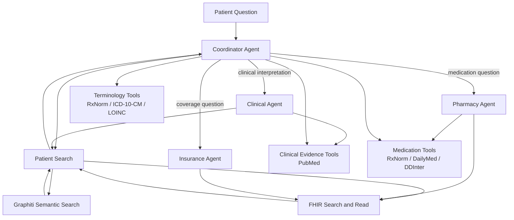
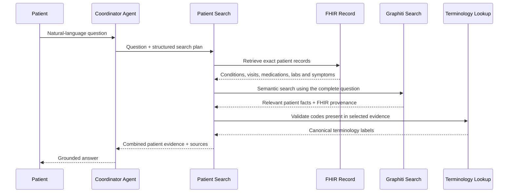
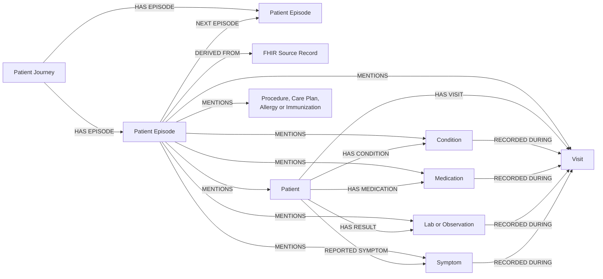
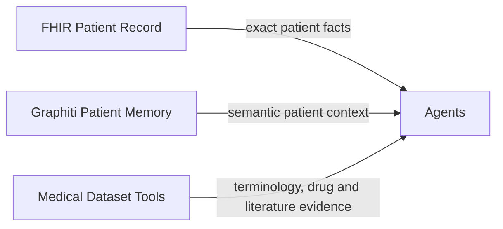

# Agent and Patient Graph Architecture

## Agents and Tools

| Agent | Main responsibility | Tools used |
|---|---|---|
| Coordinator Agent | Understands the question, calls patient search, and selects one specialist when needed | Patient Search, FHIR, terminology, medication and evidence tools |
| Clinical Agent | Explains trends, concerns, follow-up and supporting research | Patient Search, FHIR, PubMed |
| Pharmacy Agent | Handles medication identity, labels, side effects and interactions | FHIR, RxNorm, DailyMed, DDInter |
| Insurance Agent | Explains coverage information recorded for the patient | FHIR |

## How Patient Search Runs

Patient Search always combines:

1. Exact and structured patient-record retrieval.
2. Keyword and fuzzy matching over the patient record.
3. Graphiti semantic search over the patient memory graph.
4. FHIR provenance and terminology validation.

## Patient Memory Graph

### Graph Terms

| Term | Meaning |
|---|---|
| Patient | The patient represented inside an isolated graph partition |
| Patient Journey | The timeline container that keeps the patient's episodes ordered |
| Patient Episode | One visit or bounded group of clinical events at a point in time |
| Clinical entities | Conditions, medications, observations, symptoms, visits and other patient facts mentioned in an episode |
| FHIR Source Record | The exact authoritative record that supports an episode and its extracted facts |

## Data Boundary

The graph contains the patient journey and patient-specific semantic memory. RxNorm, ICD-10-CM, LOINC, DailyMed, DDInter and PubMed remain connected through tools rather than being copied into the patient graph.
