# MyHealth Agent and Clinical Memory Architecture

Status: current deployed POC architecture, July 2026

This document describes the MyHealth patient-facing agent, its authoritative
FHIR data path, deterministic clinical retrieval, Graphiti semantic memory,
provenance model, specialist agents, data contracts, and deployment topology.

## 1. Architectural principles

1. Google Cloud Healthcare FHIR is the clinical source of truth.
2. Exact values, dates, statuses, codes, and resource identity come from FHIR.
3. Graphiti is derived semantic memory, not a replacement patient database.
4. Every Graphiti fact returned to the agent must resolve to patient-owned FHIR
   provenance.
5. Exact operations such as complete lab series and current medication lists
   use deterministic FHIR processing before the LLM writes an explanation.
6. The LLM interprets questions and explains evidence; it must not select an
   incomplete subset when a deterministic operation is available.
7. Patient graph data is isolated by a hashed `group_id`.
8. Graph ingestion is explicit and synchronous. Normal patient reads never
   rebuild memory in the background.

## 2. System context

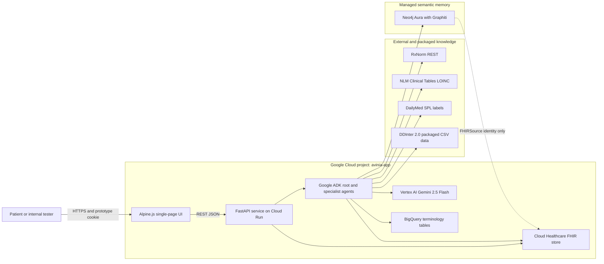

## 3. Runtime component architecture

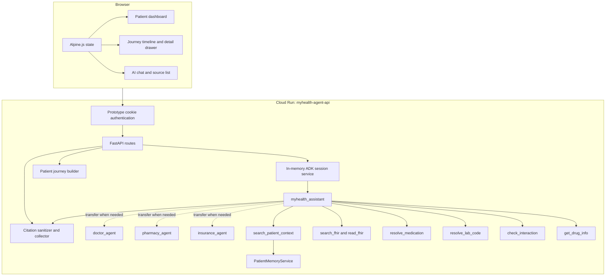

### Agent responsibilities

| Agent | Responsibility | Tools |
|---|---|---|
| `myhealth_assistant` | Primary conversation, retrieval routing, patient-friendly answer | All patient and knowledge tools |
| `doctor_agent` | Trends, clinical interpretation, red flags, clinician follow-up | Context, FHIR search/read |
| `pharmacy_agent` | Medication identity, label information, interactions | FHIR, RxNorm, DailyMed, DDInter |
| `insurance_agent` | Recorded coverage and benefit uncertainty | FHIR search/read |

Specialists are selected by the root agent. They are not run in parallel. Every
patient-record question must first call `search_patient_context` exactly once.

## 4. Hybrid patient question flow

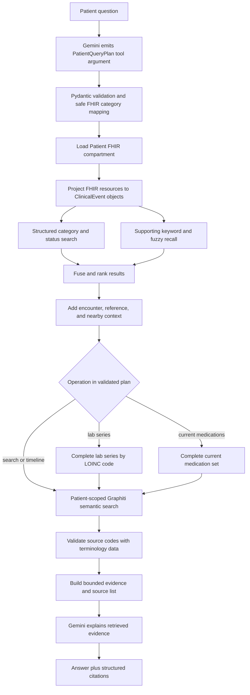

### What is deterministic and what is generative

| Concern | Deterministic | Generative |
|---|---:|---:|
| Patient identity and partition | Yes | No |
| FHIR resource loading | Yes | No |
| Natural-language date interpretation | No | Yes |
| ISO date validation and filtering | Yes | No |
| Complete lab series | Yes | No |
| Current medication status filtering | Yes | No |
| Code and exact value preservation | Yes | No |
| Citation resource identity | Yes | No |
| Vague intent and concept interpretation | No | Yes |
| Semantic relationship retrieval | Search is bounded | Graph facts were extracted by Graphiti |
| Clinical explanation wording | No | Yes |
| Diagnosis or causality inference | Prohibited | Prohibited |

## 5. Exact HbA1c sequence

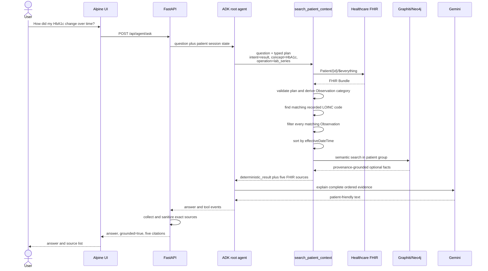

The LLM does not decide which HbA1c observations to include. It receives the
complete ordered series and controls only the final explanation.

## 6. Authoritative FHIR data model

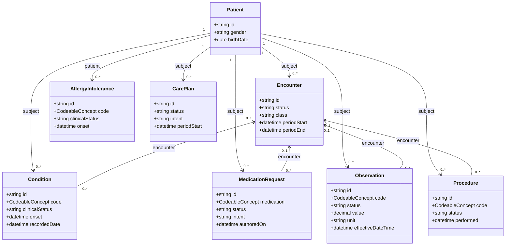

FHIR resources are never replaced by simplified database rows. Search and
journey objects are request-time projections that retain the original resource
type and ID for re-reading and citations.

## 7. Retrieval data structures

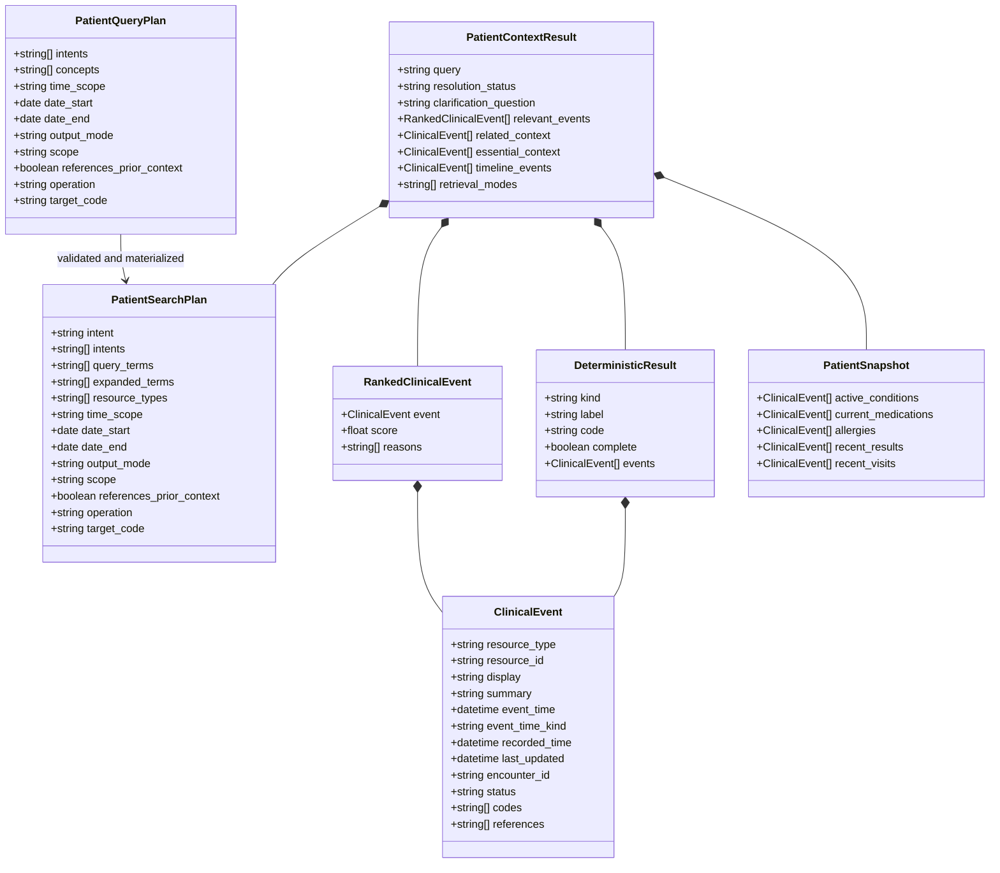

### Deterministic result example

```json
{
  "kind": "lab_series",
  "label": "HbA1c",
  "code": "4548-4",
  "complete": true,
  "events": [
    {
      "resource_type": "Observation",
      "resource_id": "obs-longitudinal-4548-4-1",
      "event_time": "2018-01-15T06:00:00+00:00",
      "summary": "HbA1c; status final; value 7.8 %"
    }
  ]
}
```

## 8. Patient journey and episode structures

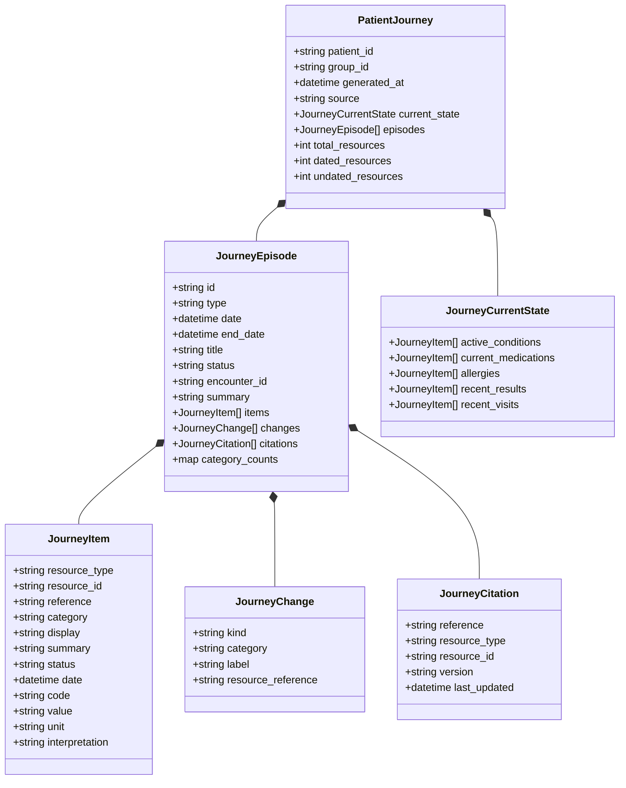

### Episode formation rules

1. Every Encounter becomes an encounter episode.
2. Resources referencing that Encounter are grouped into the same episode.
3. Remaining resources are grouped by clinical category and clinical date.
4. Undated resources remain visible in the UI journey but are excluded from
   temporal Graphiti ingestion by default.
5. Episodes are sorted using clinical time, not FHIR `meta.lastUpdated`.
6. Dense episodes are split into memory parts of at most six clinical items.
7. A visit anchor is retained in every split part when present.
8. Episode changes are derived by comparing repeated coded clinical items.
9. No causal relationship is inferred merely because events are close in time.

## 9. Graphiti physical graph

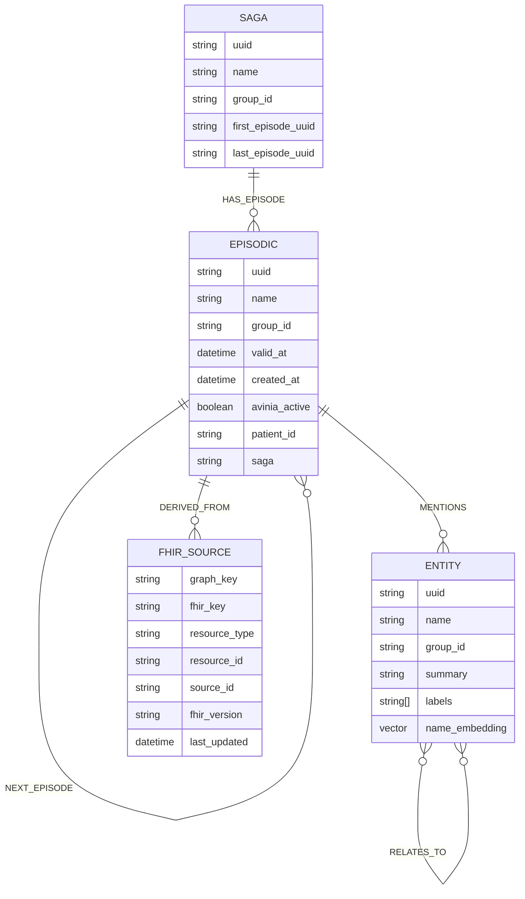

`AviniaMemoryEpisodeMap` is an application-owned idempotency and lease record.
It is not part of the clinical graph presented to the agent.

```text
AviniaMemoryEpisodeMap
  group_id
  logical_id
  content_hash
  graphiti_uuid
  status: pending | complete | failed
  owner_token
  lease_expires_at
  created_at
  completed_at
```

### Graph node roles

| Node | Role | Authoritative? |
|---|---|---:|
| `Saga` | Orders one patient's clinical journey episodes | No |
| `Episodic` | Temporal memory created from a bounded journey episode | No |
| `Entity` plus clinical label | Semantic representation extracted by Graphiti | No |
| `FHIRSource` | Compact pointer to the exact canonical FHIR resource | Identity only |
| `AviniaMemoryEpisodeMap` | Idempotent ingestion bookkeeping | Operational only |

### Graph edge roles

| Edge | From | To | Meaning |
|---|---|---|---|
| `HAS_EPISODE` | Saga | Episodic | Episode belongs to the journey |
| `NEXT_EPISODE` | Episodic | Episodic | Chronological memory order |
| `MENTIONS` | Episodic | Entity | Episode contains the entity |
| `RELATES_TO` | Entity | Entity | Graphiti semantic fact with temporal metadata |
| `DERIVED_FROM` | Episodic | FHIRSource | Exact source resources used to create episode |

## 10. Logical clinical semantic schema

Graphiti stores physical semantic edges as `RELATES_TO`. The typed extraction
schema constrains the logical relationship name and permitted endpoint types.

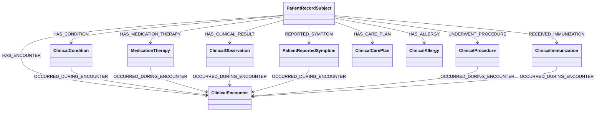

This is a closed extraction vocabulary. The ingestion sanitizer removes any
relationship with another name or an invalid source/target signature. It also
prevents Graphiti from storing calculated lab changes. Treatment indications,
drug interactions, recommendations, causal findings, and cohort membership are
resolved by deterministic sources or a separately reviewed reasoning layer;
temporal proximity cannot create them.

## 11. Graph ingestion sequence

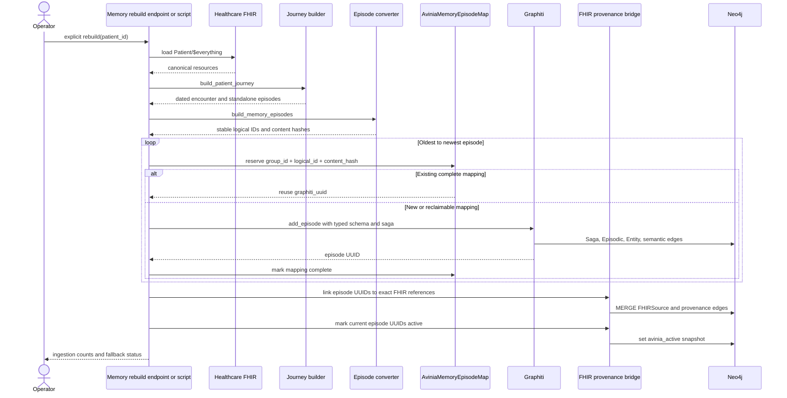

### Idempotency

The unique key is:

```text
(group_id, logical_id, content_hash)
```

An unchanged episode is reused. Changed FHIR content produces a new content hash
and therefore a new memory revision. Old revisions remain stored but are marked
inactive by `avinia_active=false`.

## 12. Semantic retrieval and provenance gate

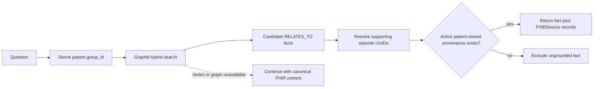

For a fact to reach the agent:

1. The Graphiti search is restricted to the patient's `group_id`.
2. The fact must reference one or more Graphiti episode UUIDs.
3. The episode must match the same patient ID and group ID.
4. The episode must have `avinia_active=true`.
5. The episode must have a patient-owned `DERIVED_FROM` FHIRSource edge.
6. The returned source identifies the exact FHIR resource and version.

Facts failing the gate are counted as excluded and are not returned.

## 13. Multi-patient isolation

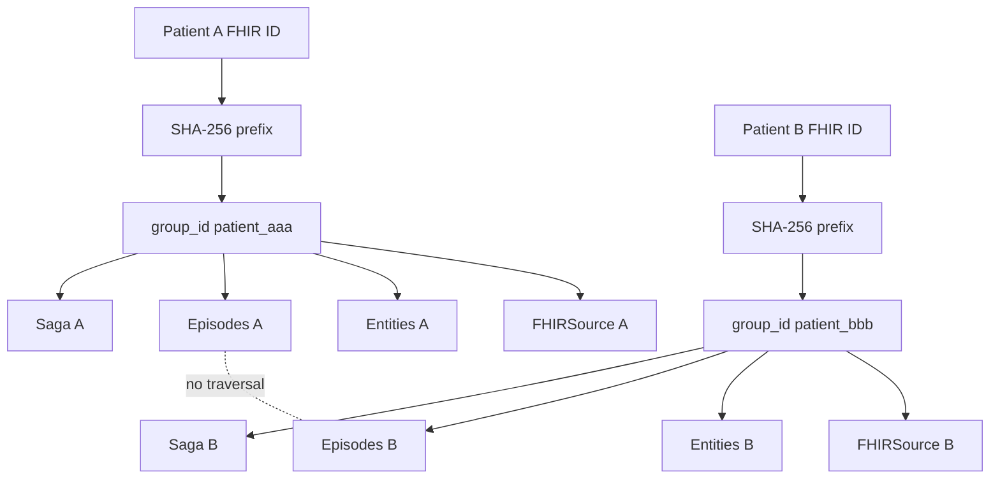

The raw patient ID is not used as Graphiti's group name. The stable group is:

```text
patient_ + first 24 hex characters of SHA-256(patient_id)
```

API chat sessions are also bound to one patient. Reusing the same session with
a different patient ID returns HTTP 409.

## 14. Terminology and knowledge sources

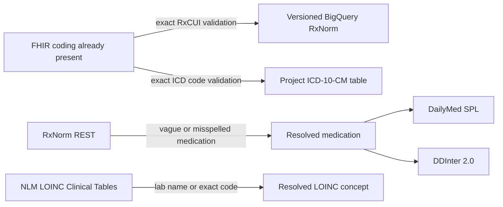

| Source | Purpose | May create patient facts? |
|---|---|---:|
| FHIR coding | Recorded patient terminology | Yes, because it is in FHIR |
| BigQuery RxNorm | Validate an existing RxCUI | No |
| BigQuery ICD-10-CM | Validate an existing ICD code | No |
| RxNorm REST | Normalize a user-supplied drug name | No |
| NLM LOINC | Resolve a lab name or code | No |
| DailyMed | Official label information | No |
| DDInter | Drug interaction lookup | No |

Terminology sources enrich and explain recorded facts. They must not create a
diagnosis that is absent from the patient's FHIR record.

## 15. API contracts

### Ask request

```json
{
  "question": "How did my HbA1c change over time?",
  "patient_id": "FHIR patient ID",
  "session_id": "conversation session",
  "user_id": "prototype user",
  "episode_resource_ids": ["Observation/example"]
}
```

### Ask response

```json
{
  "question": "How did my HbA1c change over time?",
  "patient_id": "FHIR patient ID",
  "session_id": "conversation session",
  "answer": "Patient-friendly explanation",
  "grounded": true,
  "citations": [
    {
      "number": 1,
      "id": "fhir:Observation/example",
      "type": "patient_record",
      "title": "HbA1c",
      "publisher": "Connected FHIR record",
      "resource_type": "Observation",
      "resource_id": "example",
      "date": "2018-01-15T06:00:00+00:00",
      "tools": ["search_patient_context"]
    }
  ]
}
```

### Main endpoints

| Endpoint | Purpose |
|---|---|
| `POST /api/auth/login` | Prototype shared-password login |
| `POST /api/auth/logout` | Remove prototype session cookie |
| `GET /api/auth/status` | Check prototype authentication |
| `GET /api/patient/{id}/details` | Structured FHIR patient overview |
| `GET /api/patient/{id}/journey` | Deterministic patient journey |
| `GET /api/fhir/{type}/{id}` | Read exact FHIR resource |
| `GET /api/fhir/{type}/{id}/related` | Resolve related FHIR references |
| `POST /api/agent/ask` | Run patient-scoped agent conversation |
| `GET /api/internal/patient/{id}/memory/status` | Process-local memory status |
| `POST /api/internal/patient/{id}/memory/rebuild` | Explicit synchronous memory rebuild |

## 16. Citation architecture

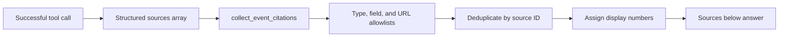

Allowed source classes are:

- Patient FHIR record
- DailyMed drug label
- RxNorm, LOINC, or ICD terminology
- DDInter interaction lookup

Model-written source claims are ignored. A citation must originate in a tool
response. Exact deterministic operations narrow the source list to their exact
FHIR evidence keys before citation collection.

## 17. Deployment topology

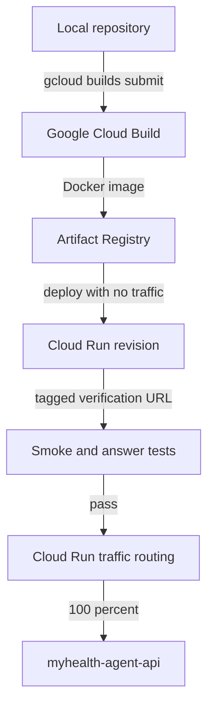

Runtime dependencies:

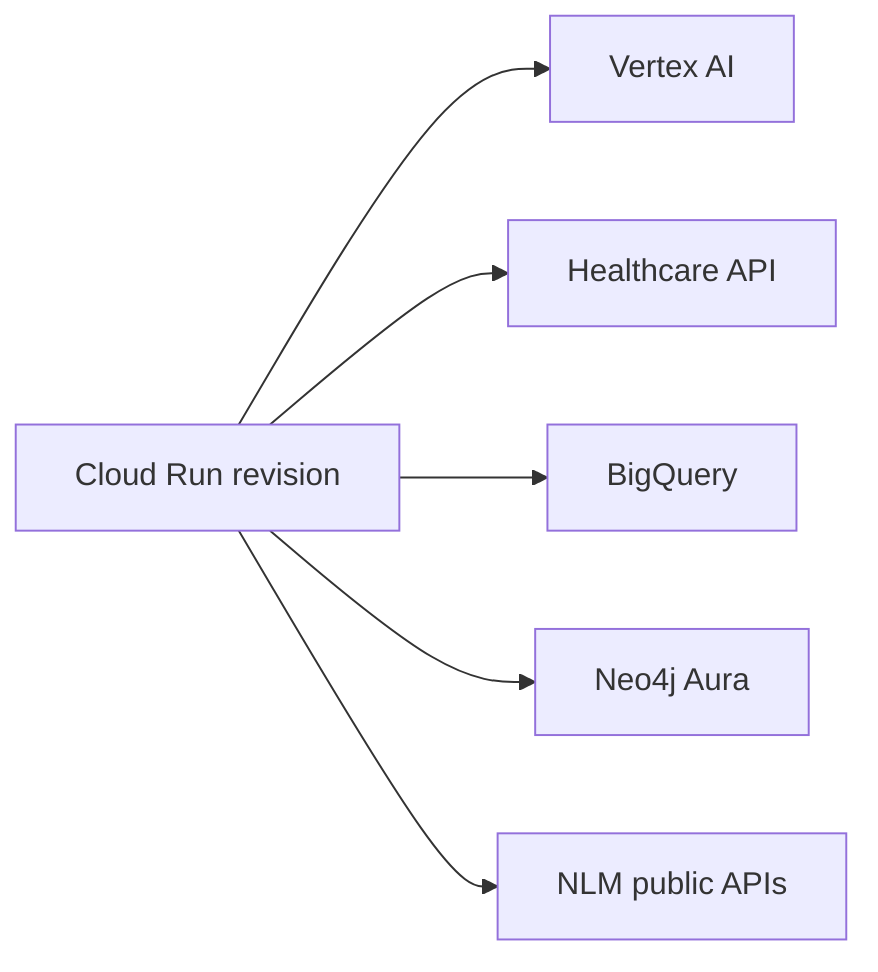

Graphiti Vertex calls use retry with exponential backoff and jitter for 429 and
5xx responses. If semantic retrieval remains unavailable, the patient answer
continues using canonical FHIR context.

## 18. Failure and fallback behavior

| Failure | Behavior | Clinical effect |
|---|---|---|
| Graphiti disabled | Return no semantic facts | Exact FHIR retrieval continues |
| Graphiti or Vertex failure | Record fallback reason | Exact FHIR retrieval continues |
| Ungrounded Graphiti fact | Exclude fact | It cannot influence the answer |
| RxNorm or ICD enrichment failure | Retain original FHIR coding with warning | Patient fact remains unchanged |
| DailyMed unavailable | Return no label result | Agent must not invent label content |
| DDInter no matching pair | Return no recorded interaction match | Must not claim proven absence of all interactions |
| FHIR unavailable | Patient-record query fails | No model-only patient answer |
| Ambiguous medication | Ask which recorded medicine | No guessed medication identity |
| Unknown patient term | Return `not_found` | No unrelated recent fact is presented as a match |

## 19. Example graph queries

### Entire active patient memory graph

```cypher
MATCH path =
  (saga:Saga)-[:HAS_EPISODE]->
  (episode:Episodic)-[:MENTIONS]->
  (entity:Entity)
WHERE episode.group_id = $group_id
  AND episode.avinia_active = true
RETURN path
LIMIT 500;
```

### Episodes with exact FHIR provenance

```cypher
MATCH path =
  (episode:Episodic)-[:DERIVED_FROM]->
  (source:FHIRSource)
WHERE episode.group_id = $group_id
  AND episode.avinia_active = true
RETURN path
LIMIT 500;
```

### Entity facts and their source episodes

```cypher
MATCH (left:Entity)-[fact:RELATES_TO]->(right:Entity)
WHERE fact.group_id = $group_id
OPTIONAL MATCH (episode:Episodic)-[:MENTIONS]->(left)
WHERE episode.group_id = $group_id
  AND episode.avinia_active = true
OPTIONAL MATCH (episode)-[:DERIVED_FROM]->(source:FHIRSource)
RETURN left, fact, right, episode, source
LIMIT 300;
```

### Chronological episode chain

```cypher
MATCH path =
  (first:Episodic)-[:NEXT_EPISODE*0..]->(later:Episodic)
WHERE first.group_id = $group_id
  AND first.avinia_active = true
  AND later.avinia_active = true
RETURN path
LIMIT 200;
```

## 20. Current boundaries and extension points

### Implemented now

- Canonical FHIR patient retrieval
- Gemini-generated, Pydantic-validated patient query plans
- Structured FHIR retrieval with supporting keyword and fuzzy recall
- Deterministic current medication results
- Deterministic complete lab series
- Encounter-aware patient journey
- Graphiti episodic semantic memory
- Patient-scoped provenance gate
- RxNorm, LOINC, ICD-10-CM, DailyMed, and DDInter access
- Root plus doctor, pharmacy, and insurance agents
- Structured source metadata in the UI

### Schema-ready but not yet a complete service

- Guideline ingestion and versioning
- Evidence-backed recommendation lifecycle
- Physician review and feedback nodes
- Population cohort computation
- Recommendation acceptance or rejection workflow
- Deterministic before/after medication event operator
- Deterministic visit-summary operator
- Full claim-to-citation mapping for every broad narrative sentence

These additions should preserve the same boundary: FHIR and reviewed evidence
remain authoritative, while Graphiti stores temporal semantic memory and
explainable relationships.

## 21. Non-negotiable invariants

1. Never overwrite canonical FHIR with Graphiti output.
2. Never return a Graphiti fact without patient-owned active provenance.
3. Never infer diagnosis or causality from temporal proximity alone.
4. Never invent terminology mappings or citations.
5. Never use one patient's group ID to search another patient's graph.
6. Never use FHIR `meta.lastUpdated` as clinical onset when a clinical date is
   available.
7. Never let a generic top-N search truncate an exact complete operation.
8. Never rebuild Graphiti memory as an implicit side effect of a patient read.
9. Never return external medical knowledge as though it were recorded patient
   history.
10. Every answer must remain useful when Graphiti is unavailable by falling
    back to canonical FHIR evidence.
