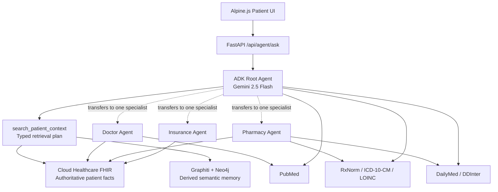
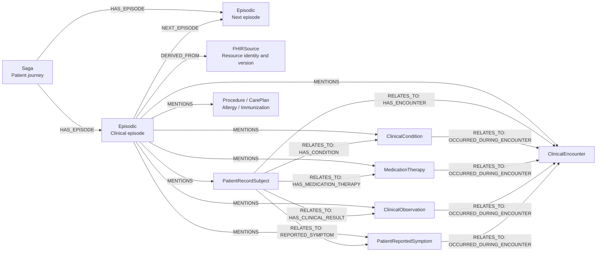

# Current Agent and Graph Architecture

This document gives a basic view of the current Avinia PatientGraphAgent POC.
It covers the agent flow, data boundaries, and Graphiti nodes and edges.

## Current Scope

- One patient is currently loaded into the clinical memory graph.
- Cloud Healthcare FHIR is the authoritative patient record.
- Graphiti and Neo4j store derived episodic and semantic memory.
- External terminology, drug, interaction, and literature datasets are accessed by agent tools.
- External datasets are not currently loaded as shared Neo4j knowledge nodes.

## Agent Architecture



### Request Flow

1. The UI sends a question, patient ID, and session ID to FastAPI.
2. The root agent creates a typed patient retrieval plan.
3. `search_patient_context` retrieves and ranks canonical FHIR evidence.
4. Graphiti semantic search adds patient-scoped, provenance-linked memory facts.
5. The root agent may transfer to one specialist when focused interpretation is needed.
6. External medical knowledge is retrieved through tools when required.
7. FastAPI collects citations from actual tool responses and returns the answer to the UI.

The current implementation does not run the doctor, pharmacy, and insurance agents in parallel.

## Graphiti Graph



## Node List

| Node | Purpose |
|---|---|
| `Saga` | Patient-scoped journey container |
| `Episodic` | Bounded dated clinical memory episode |
| `FHIRSource` | Pointer to the authoritative FHIR resource and version |
| `PatientRecordSubject` | Non-identifying patient entity within the graph partition |
| `ClinicalEncounter` | Visit, emergency encounter, or admission |
| `ClinicalCondition` | Recorded diagnosis, condition, or problem |
| `MedicationTherapy` | Medication order, statement, dispense, or administration |
| `ClinicalObservation` | Laboratory result, vital sign, or assessment |
| `PatientReportedSymptom` | Recorded symptom or complaint |
| `ClinicalProcedure` | Diagnostic, therapeutic, or preventive procedure |
| `ClinicalCarePlan` | Care plan, goal, or planned clinical activity |
| `ClinicalAllergy` | Recorded allergy or intolerance |
| `ClinicalImmunization` | Recorded vaccine administration |

Clinical nodes are Graphiti `Entity` nodes with the corresponding typed label.

## Edge List

| Edge | Meaning |
|---|---|
| `HAS_EPISODE` | Connects a patient journey Saga to its episodes |
| `NEXT_EPISODE` | Orders episodes chronologically |
| `MENTIONS` | Connects an episode to entities present in that episode |
| `DERIVED_FROM` | Connects an episode to its canonical FHIR provenance |
| `RELATES_TO` | Physical Graphiti relationship between typed clinical entities |

The allowed clinical names carried by `RELATES_TO` are:

- `HAS_ENCOUNTER`
- `HAS_CONDITION`
- `HAS_MEDICATION_THERAPY`
- `HAS_CLINICAL_RESULT`
- `REPORTED_SYMPTOM`
- `UNDERWENT_PROCEDURE`
- `HAS_CARE_PLAN`
- `HAS_ALLERGY`
- `RECEIVED_IMMUNIZATION`
- `OCCURRED_DURING_ENCOUNTER`

## Data Boundaries

```text
FHIR
  Authoritative patient conditions, medications, observations, dates and statuses

Graphiti / Neo4j
  Patient episodes, semantic entities, temporal facts and FHIR provenance pointers

Agent tools
  RxNorm, ICD-10-CM, LOINC, DailyMed, DDInter and PubMed
```

Graphiti facts are treated as derived context. Exact clinical claims must remain supported by the connected FHIR evidence.
